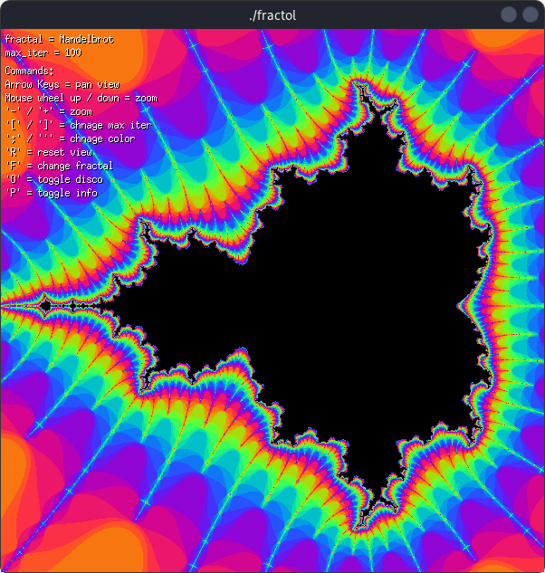
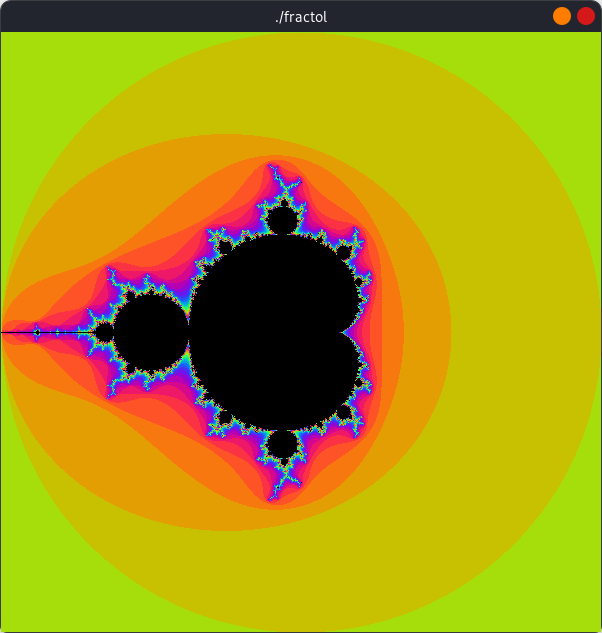
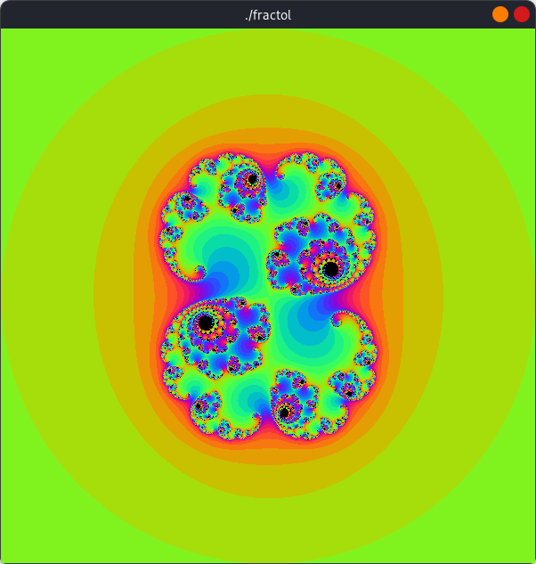
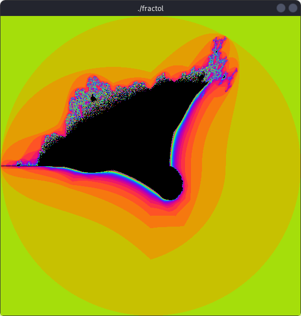

# fract-ol

A real-time interactive fractal explorer written in C using the MiniLibX graphics library. Built as a project at 42/1337 school.



---

## Table of Contents

- [About](#about)
- [Supported Fractals](#supported-fractals)
- [Screenshots](#screenshots)
- [Requirements](#requirements)
- [Installation](#installation)
- [Usage](#usage)
- [Controls](#controls)
- [Features](#features)
- [Project Structure](#project-structure)
- [How It Works](#how-it-works)
- [Author](#author)

---

## About

fract-ol is a graphical exploration tool for mathematical fractals. It renders the Mandelbrot set, Julia sets, and the Burning Ship fractal in real time, with smooth coloring, infinite zoom, panning, and interactive parameter manipulation. The project demonstrates low-level graphics programming, complex number mathematics, and event-driven design in C.

---

## Supported Fractals

| Fractal | Description |
|---|---|
| **Mandelbrot** | The classic Mandelbrot set, defined by iterating $z_{n+1} = z_n^2 + c$ where $c$ is the pixel coordinate. |
| **Julia** | A family of fractals using $z_{n+1} = z_n^2 + c$ where $c$ is a fixed complex constant and $z_0$ is the pixel coordinate. |
| **Burning Ship** | A variation of the Mandelbrot set that takes the absolute values of the real and imaginary parts before squaring, producing a ship-like shape. |

---

## Screenshots


| Mandelbrot | Julia | Burning Ship |
|---|---|---|
|  |  |  |

| Zoom Demo | Julia Map | Disco Mode |
|---|---|---|
|  |  |  |

---

## Requirements

- Linux (X11 window system)
- GCC or compatible C compiler
- MiniLibX library (installed at `/usr/include/minilibx-linux`)
- X11 development libraries (`libXext`, `libX11`)
- `make`

---

## Installation

1. Clone the repository:

```sh
git clone <repository-url> fractol
cd fractol
```

2. Build the project:

```sh
make
```

This compiles the custom `libft` library and all source files, then links against MiniLibX and X11.

3. Clean build artifacts:

```sh
make clean    # remove object files
make fclean   # remove object files and binary
make re       # full rebuild
```

---

## Usage

```
./fractol <fractal> [options]
```

### Fractal argument

| Argument | Fractal |
|---|---|
| `M` or `Mandelbrot` | Mandelbrot set |
| `J` or `Julia` | Julia set |
| `B` or `Burning_ship` | Burning Ship fractal |

Arguments are case-insensitive.

### Options

| Option | Description | Default |
|---|---|---|
| `-s <WxH>` | Set the window size in pixels | `600x600` |
| `-j <c>` | Set the Julia constant as a complex number | `0.285 + 0.01i` |

### Examples

```sh
./fractol Mandelbrot
./fractol Julia -j "-0.8 + 0.156i"
./fractol Burning_ship -s 800x800
./fractol J -j "0.355 + 0.355i" -s 900x900
```

---

## Controls

Press `P` while running to display an on-screen overlay of all controls.

### Navigation

| Key / Input | Action |
|---|---|
| Arrow keys | Pan the view |
| Mouse scroll up | Zoom in (centered on cursor) |
| Mouse scroll down | Zoom out (centered on cursor) |
| `+` | Zoom in |
| `-` | Zoom out |

### Rendering

| Key | Action |
|---|---|
| `]` | Increase max iterations (+10) |
| `[` | Decrease max iterations (-10, minimum 10) |
| `'` | Next color scheme |
| `;` | Previous color scheme |
| `O` | Toggle disco mode (animated color cycling) |

### Fractal

| Key | Action |
|---|---|
| `F` | Cycle to the next fractal type |
| `M` | Toggle the Julia map window (Julia set only) |

The Julia map opens a secondary 300x300 window showing the Mandelbrot set. Click and drag on the map to interactively change the Julia constant `c` in real time.

### General

| Key | Action |
|---|---|
| `R` | Reset view to defaults |
| `P` | Toggle info overlay |
| `Escape` | Quit |

---

## Features

- **Real-time rendering** -- Fractals are computed and displayed pixel by pixel with immediate visual feedback on every interaction.
- **Smooth sinusoidal coloring** -- Colors are generated using offset sine waves across RGB channels, producing smooth gradients that highlight fractal detail.
- **Cursor-centered zoom** -- Mouse wheel zoom tracks the cursor position, allowing precise exploration of specific regions.
- **Dynamic iteration control** -- Increase or decrease the iteration depth on the fly to balance detail and performance.
- **Interactive Julia map** -- A secondary window renders the Mandelbrot set and lets you click and drag to pick Julia constants in real time, immediately updating the main fractal view.
- **Disco mode** -- Continuously cycles through color schemes for an animated visual effect.
- **Fractal cycling** -- Switch between all three fractal types without restarting the program.
- **On-screen info overlay** -- Displays the current fractal type, iteration count, and a full list of controls directly on the window.
- **Custom window size** -- Configure the rendering resolution from the command line.
- **Proper resource cleanup** -- All MiniLibX resources, images, and windows are properly freed on exit.

---

## Project Structure

```
fractol/
├── Makefile                  Build system
├── include/
│   └── fractol.h             Header with structs, prototypes, and constants
├── libft/                    Custom C standard library
│   ├── Makefile
│   ├── libft.h
│   └── *.c                  String, memory, list, and I/O utilities
└── src/
    ├── main.c                Entry point, MLX initialization, event loop
    ├── parsing.c             Command-line argument parsing
    ├── error.c               Cleanup, usage message, and error handling
    ├── plot.c                Pixel plotting and fractal rendering loop
    ├── mandelbrot.c          Mandelbrot set computation
    ├── julia.c               Julia set computation
    ├── burning_ship.c        Burning Ship fractal computation
    ├── color.c               Sinusoidal RGB color mapping
    ├── info.c                On-screen info and controls overlay
    ├── key_hook.c            Keyboard event handlers
    ├── mouse_hook.c          Mouse event handlers (zoom)
    ├── loop_hook.c           Main loop hook (disco mode, Julia map drag)
    ├── map.c                 Julia map window creation and rendering
    ├── map_hooks.c           Julia map window event handlers
    └── ft_atof.c             String-to-double conversion utility
```

---

## How It Works

Each pixel on screen is mapped to a point on the complex plane. The program applies the corresponding fractal iteration formula to that point and counts how many iterations it takes to escape a radius of 2 (escape threshold $|z|^2 > 4$). The iteration count is then mapped to a color using a sinusoidal function:

$$r = \sin(0.3 \cdot \text{iter} + \text{offset}) \cdot 127 + 128$$

Points that never escape within the maximum iteration limit are colored black, representing the interior of the fractal set.

Zooming works by adjusting a scale factor that controls how much of the complex plane is visible per pixel. Panning shifts the origin offset. All transformations are applied each frame, so the fractal is re-rendered on every interaction.

---

## Author

**smakkass** -- 42/1337 School

- Intra: [smakkass](https://profile.intra.42.fr/users/smakkass)
